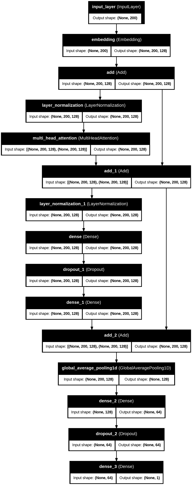

# NLP Tasks with Keras NLP and Hugging Face

This assignment focuses on implementing various Natural Language Processing (NLP) tasks using Keras NLP and Hugging Face libraries. The assignment demonstrates three key NLP patterns: inference with pretrained classifiers, fine-tuning pretrained backbones, and building transformers from scratch.

## Notebooks

### 1. Inference with a Pretrained Classifier

- **Notebook**: [Inference_Pretrained_Classifier.ipynb](https://colab.research.google.com/github/pruthvik-sheth/CMPE-258-Deep-Learning/blob/main/Assignments/Assignment-10/notebooks/Inference_Pretrained_Classifier.ipynb)
- **Description**: This notebook demonstrates how to use pretrained NLP models for inference tasks such as text classification, sentiment analysis, and text generation. It leverages models from Keras NLP or Hugging Face's transformers library to perform predictions on new text data without additional training.
- **Key Concepts**:
  - Loading pretrained models
  - Text preprocessing for inference
  - Generating predictions on new data
  - Interpreting model outputs

### 2. Fine-tuning a Pretrained Backbone

- **Notebook**: [Finetuning_Pretrained_Backbone.ipynb](https://colab.research.google.com/github/pruthvik-sheth/CMPE-258-Deep-Learning/blob/main/Assignments/Assignment-10/notebooks/Finetuning_Pretrained_Backbone.ipynb)
- **Description**: This notebook shows how to take a pretrained language model and fine-tune it for a specific downstream task like sentiment analysis. It demonstrates transfer learning techniques in NLP by adapting a general-purpose language model to a specialized task.
- **Key Concepts**:
  - Transfer learning in NLP
  - Dataset preparation for fine-tuning
  - Adapting pretrained models for specific tasks
  - Evaluation of fine-tuned models

### 3. Building a Transformer from Scratch

- **Notebook**: [Transformer_From_Scratch.ipynb](https://colab.research.google.com/github/pruthvik-sheth/CMPE-258-Deep-Learning/blob/main/Assignments/Assignment-10/notebooks/Transformer_From_Scratch.ipynb)
- **Description**: This notebook implements a transformer architecture from scratch for text classification tasks. It provides a deep understanding of the transformer architecture by building each component (multi-head attention, feed-forward networks, etc.) step by step.
- **Key Concepts**:
  - Transformer architecture components
  - Self-attention mechanisms
  - Positional encoding
  - Training transformers for text classification

## Video Walkthrough

A detailed video walkthrough of all three notebooks, including explanations of the code and debugging traces, is available on YouTube:

[Assignment 10 Video Walkthrough](https://youtu.be/zulm_5MykF0)

## References and Resources

The implementation is based on the following resources:

1. Keras NLP Documentation:

   - [Keras NLP Guides](https://keras.io/keras_nlp/#guides)
   - [Keras Hub Transformer Pretraining](https://keras.io/keras_hub/guides/transformer_pretraining)
   - [Keras NLP Examples](https://keras.io/examples/nlp)

2. Hugging Face Resources:

   - [Hugging Face Transformers Documentation](https://huggingface.co/docs/transformers/index)
   - [Fine-tuning BERT Example](https://github.com/HandsOnLLM/Hands-On-Large-Language-Models/blob/main/chapter11/Chapter%2011%20-%20Fine-Tuning%20BERT.ipynb)

3. Additional Examples:
   - [Text Classification with Transformer](https://keras.io/examples/nlp/text_classification_with_transformer)
   - [Keras Hub Getting Started](https://colab.research.google.com/github/keras-team/keras-io/blob/master/guides/ipynb/keras_hub/getting_started.ipynb)
